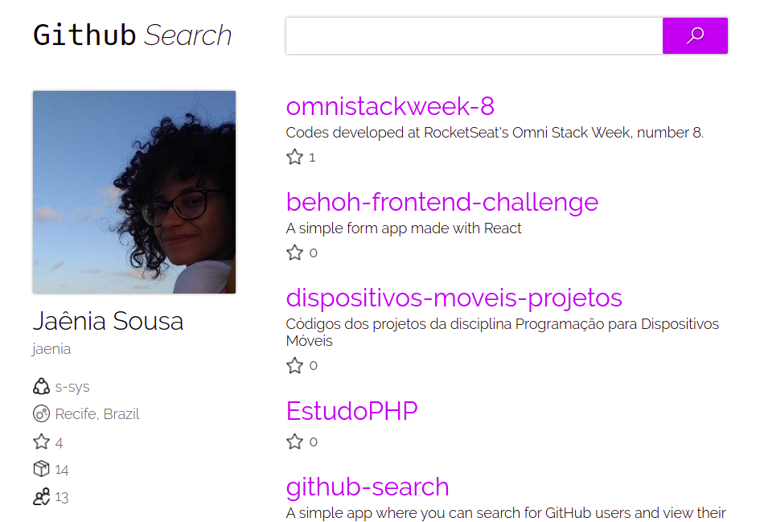
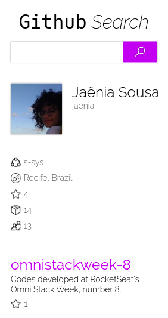

<h1 align="center">
  GitHub Search
</h1>

  [Live Demo](https://kind-edison-a8c216.netlify.app/)

<h3 align="center">
  A simple app where you can search for GitHub users and view their repositories.
</h3>

  &nbsp;
  &nbsp;
  

## Overview

* Test coverage: 87% :mag:
* Lighthouse audits:
  * Performance: 83
  * Accessibility: 100
  * Best practices: 100
  * SEO: 90
  * PWA: -

### Technologies
* ReactJS
* React Hooks
* Styled Componentes
* Jest
* React Testing Library

### Instalation

Clone the repository and run command below:  
`yarn install or npm install`

### Start
`yarn start or npm start`

### Test
`yarn test or npm test`

### Test coverage
`yarn test --coverage --watchAll=false`

## Commit messages

`feature/*`: Adds a new feature.

`ref/*`: Refactoring/Improvements of existing features.

`chore/*`: Config changes.

`fix/*`: Fixes a bug in development.

`test/*`: Adds or changes tests.

## Preview

  

